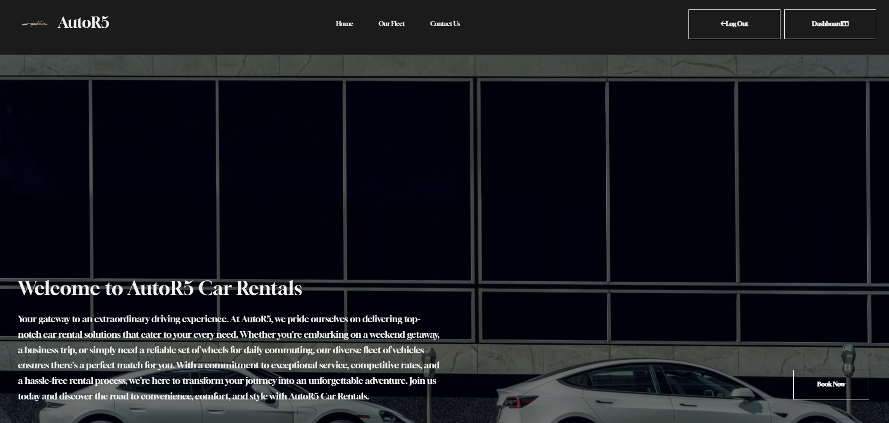

# autoR5 Car Rental System

Welcome to **autoR5**, a comprehensive car rental system developed for a fictional car rental company based in Dublin. This system allows users to browse, book, and manage vehicle rentals of various classes, providing a seamless and user-friendly experience for both customers and administrators.

## Table of Contents

1. [Project Overview](#project-overview)
2. [Key Features](#key-features)
3. [Project Structure](#project-structure)
4. [Getting Started](#getting-started)
   1. [Requirements](#requirements)
   2. [Initial startup](#initial-startup)
5. [Design](#wireframes)
6. [Technologies](#technologies)
7. [Deployment](#deployment)
8. [The Code (Powered by Django)](README_TheCode.md#the-code-powered-by-django)
   1. [Models](README_TheCode.md#models)
      1. [Car Model](README_TheCode.md#car-model)
      2. [Booking Model](README_TheCode.md#booking-model)
      3. [Payment Model](README_TheCode.md#payment-model)
      4. [CancellationRequest Model](README_TheCode.md#cancellationrequest-model)
      5. [Review Model](README_TheCode.md#review-model)
      6. [UserProfile Model](README_TheCode.md#userprofile-model)
      7. [ContactFormSubmission Model](README_TheCode.md#contactformsubmission-model)
   2. [Admin](README_TheCode.md#admin)
      1. [CarAdmin](README_TheCode.md#caradmin)
      2. [BookingAdmin](README_TheCode.md#bookingadmin)
      3. [ReviewAdmin](README_TheCode.md#reviewadmin)
      4. [UserProfileAdmin](README_TheCode.md#userprofileadmin)
      5. [PaymentAdmin](README_TheCode.md#paymentadmin)
      6. [CancellationRequestAdmin](README_TheCode.md#cancellationrequestadmin)
      7. [ContactFormSubmissionAdmin](README_TheCode.md#contactformsubmissionadmin)
   3. [App Configuration: autoR5](README_TheCode.md#app-configuration-autor5)
   4. [Forms](README_TheCode.md#forms)
      1. [CustomSignupForm](README_TheCode.md#customsignupform)
      2. [BookingForm](README_TheCode.md#bookingform)
      3. [ReviewForm](README_TheCode.md#reviewform)
      4. [ContactForm](README_TheCode.md#contactform)
      5. [CancellationRequestForm](README_TheCode.md#cancellationrequestform)
      6. [UserProfileForm](README_TheCode.md#userprofileform)
      7. [CsvImportForm](README_TheCode.md#csvimportform)
   5. [Signals](README_TheCode.md#signals)
      1. [Custom Signals and Receivers](README_TheCode.md#custom-signals-and-receivers)
         1. [RefundProcessingError](README_TheCode.md#refundprocessingerror)
         2. [create_user_profile Signal Receiver](README_TheCode.md#create_user_profile-signal-receiver)
         3. [process_cancellation_request Signal Receiver](README_TheCode.md#process_cancellation_request-signal-receiver)
   6. [URL Patterns](README_TheCode.md#url-patterns)
      1. [Index](README_TheCode.md#index)
      2. [Car Detail](README_TheCode.md#car-detail)
      3. [Book Car](README_TheCode.md#book-car)
      4. [Booking Confirmation](README_TheCode.md#booking-confirmation)
      5. [Leave Review](README_TheCode.md#leave-review)
      6. [Cars List](README_TheCode.md#cars-list)
      7. [Contact](README_TheCode.md#contact)
      8. [Customer Dashboard](README_TheCode.md#customer-dashboard)
      9. [Edit Profile](README_TheCode.md#edit-profile-edit_profile)
      10. [Get Car Makes](README_TheCode.md#get-car-makes-get_car_makes)
      11. [Get Car Models](README_TheCode.md#get-car-models-get_car_models)
      12. [Get Car Years](README_TheCode.md#get-car-years-get_car_years)
      13. [Get Car Locations](README_TheCode.md#get-car-locations-get_car_locations)
      14. [Get Car Types](README_TheCode.md#get-car-types-get_car_types)
      15. [Get Fuel Types](README_TheCode.md#get-fuel-types-get_fuel_types)
      16. [Checkout](README_TheCode.md#checkout)
   7. [Project Settings Documentation](README_TheCode.md#project-settings-documentation)
      1. [Key Project Information](README_TheCode.md#key-project-information)
      2. [Project Structure](README_TheCode.md#project-structure)
      3. [Security and Authentication](README_TheCode.md#security-and-authentication)
      4. [Installed Apps](README_TheCode.md#installed-apps)
      5. [Authentication and User Management](README_TheCode.md#authentication-and-user-management)
      6. [Middleware](README_TheCode.md#middleware)
      7. [Template Configuration](README_TheCode.md#template-configuration)
      8. [Database Configuration](README_TheCode.md#database-configuration)
      9. [Password Validation](README_TheCode.md#password-validation)
     10. [Internationalization and Time Zone](README_TheCode.md#internationalization-and-time-zone)
     11. [Static and Media Files](README_TheCode.md#static-and-media-files)
     12. [Email Configuration](README_TheCode.md#email-configuration)
     13. [Additional Features](README_TheCode.md#additional-features)
   8. [Views](README_TheCode.md#views)
    1. [Home Page (index)](README_TheCode.md#home-page-index)
    2. [List of Cars (cars_list)](README_TheCode.md#list-of-cars-cars_list)
    3. [Get Car Makes (get_car_makes)](README_TheCode.md#get-car-makes-get_car_makes)
    4. [Get Car Models (get_car_models)](README_TheCode.md#get-car-models-get_car_models)
    5. [Get Car Years (get_car_years)](README_TheCode.md#get-car-years-get_car_years)
    6. [Get Car Types (get_car_types)](README_TheCode.md#get-car-types-get_car_types)
    7. [Get Fuel Types (get_fuel_types)](README_TheCode.md#get-fuel-types-get_fuel_types)
    8. [Car Detail (car_detail)](README_TheCode.md#car-detail-car_detail)
    9. [Book a Car (book_car)](README_TheCode.md#book-a-car-book_car)
    10. [Checkout (checkout)](README_TheCode.md#checkout-checkout)
    11. [Booking Confirmation (booking_confirmation)](README_TheCode.md#booking-confirmation-booking_confirmation)
    12. [Leave a Review (leave_review)](README_TheCode.md#leave-a-review-leave_review)
    13. [Customer Dashboard (customer_dashboard)](README_TheCode.md#customer-dashboard-customer_dashboard)
    14. [Edit Profile (edit_profile)](README_TheCode.md#edit-profile-edit_profile)
    15. [Contact (contact)](README_TheCode.md#contact-contact)
9. [base.html Template Documentation](README_TheCode.md#base.html-template-documentation)
   1. [Meta Tags and Favicon](README_TheCode.md#meta-tags-and-favicon)
   2. [Title](README_TheCode.md#title)
   3. [Styles and Scripts](README_TheCode.md#styles-and-scripts)
   4. [Navigation Menu](README_TheCode.md#navigation-menu)
   5. [Message Alerts](README_TheCode.md#message-alerts)
   6. [Page Content](README_TheCode.md#page-content)
   7. [Footer](README_TheCode.md#footer)
   8. [JavaScript and Other Libraries](README_TheCode.md#javascript-and-other-libraries)
10. [JavaScript](README_TheCode.md#javascript)
   1. [Jarallax Parallax Scrolling](README_TheCode.md#jarallax-parallax-scrolling)
   2. [Message Alerts](README_TheCode.md#message-alerts)
   3. [Filtering Options](README_TheCode.md#filtering-options)
   4. [Display Car Location on a Map](README_TheCode.md#display-car-location-on-a-map)
   5. [Payment Handling](README_TheCode.md#payment-handling)
11. [Tests](README_Tests.md#Tests)
    1. [Testing Overview](README_Tests.md#testing-overview)
    2. [Responsiveness Test](README_Tests.md#responsiveness)
    3. [Accessability Test](README_Tests.md#accessability)
    4. [Lighthouse Test](README_Tests.md#lighthouse-test)
    5. [Weblink Test](README_Tests.md#weblink-test)
    6. [Validator Test](README_Tests.md#validator-tests)
    6. [Automated Tests](README_Tests.md#automated-tests)
    7. [CarModelTest - Testing Car Model](README_Tests.md#carmodeltest---testing-car-model)
    8. [BookingModelTest - Testing Booking Model](README_Tests.md#bookingmodeltest---testing-booking-model)
    9. [PaymentModelTest - Testing Payment Model](README_Tests.md#paymentmodeltest---testing-payment-model)
    10. [CancellationModelTest - Testing Cancellation Request Model](README_Tests.md#cancellationmodeltest---testing-cancellation-request-model)
    11. [ReviewModelTest - Testing Review Model](README_Tests.md#reviewmodeltest---testing-review-model)
    12. [UserProfileModelTest - Testing User Profile Model](README_Tests.md#userprofilemodeltest---testing-user-profile-model)
    13. [ContactFormSubmissionModelTest - Testing Contact Form Submission Model](README_Tests.md#contactformsubmissionmodeltest---testing-contact-form-submission-model)
    14. [EditProfileViewTest - Testing the Edit Profile View](README_Tests.md#editprofileviewtest---testing-the-edit-profile-view)
    15. [ContactViewTest - Testing the Contact Form Submission](README_Tests.md#contactviewtest---testing-the-contact-form-submission)
    16. [CustomSignupFormTest - Testing Custom Signup Form](README_Tests.md#customsignupformtest---testing-custom-signup-form)
    17. [BookingFormTest - Testing Booking Form](README_Tests.md#bookingformtest---testing-booking-form)
    18. [ReviewFormTest - Testing Review Form](README_Tests.md#reviewformtest---testing-review-form)
    19. [ContactFormTest - Testing Contact Form](README_Tests.md#contactformtest---testing-contact-form)
    20. [CancellationRequestFormTest - Testing Cancellation Request Form](README_Tests.md#cancellationrequestformtest---testing-cancellation-request-form)
    21. [UserProfileFormTest - Testing User Profile Form](README_Tests.md#userprofileformtest---testing-user-profile-form)
    22. [CsvImportExportFormTest - Testing CSV Import and Export Forms](README_Tests.md#csvimportexportformtest---testing-csv-import-and-export-forms)
    23. [UpdateLocationTest - Testing Location Update](README_Tests.md#updatelocationtest---testing-location-update)
    24. [TestUrls - Testing URL Routing](README_Tests.md#testurls---testing-url-routing)
    25. [JarallaxTest - Testing Jarallax Initialization](README_Tests.md#jarallaxtest---testing-jarallax-initialization)
    26. [MessageAlertsTest - Testing Message Alerts](README_Tests.md#messagealertstest---testing-message-alerts)
    27. [AJAXFilterTests - Testing AJAX-Based Filtering](README_Tests.md#ajaxfiltertests---testing-ajax-based-filtering)
    28. [MapTest - Testing Map Display](README_Tests.md#maptest---testing-map-display)

# Project Overview

**autoR5** is designed to facilitate the rental process, from vehicle selection to payment and booking management. It empowers our fictional car rental company to efficiently manage its vehicle fleet and customer reservations.



# Key Features

- **Vehicle Catalog**: Browse and search for vehicles by class, location, and availability.
- **User Registration and Authentication**: Users can create accounts, sign in, and manage their profiles.
- **Booking**: Users can book vehicles, specifying rental dates and locations.
- **Availability Checking**: Real-time availability checking to prevent overbooking.
- **Pricing**: Dynamic pricing based on vehicle class and rental duration.
- **Conflict Resolution**: Avoids booking conflicts by checking for overlapping rental dates.
- **Payment Integration**: Secure payment processing with the Stripe payment gateway.
- **Booking Management**: Customers can view and manage their bookings.
- **Admin Panel**: Administrative tools for managing vehicles, bookings, and user data.

# Project Structure


This repository contains the Django project and application files that make up the **autoR5** car rental system. The project is organized as follows:

- **root directory/** : contains all top-level directories for the app, project, static files, and templates.
- **autoR5_project4/**: The main project directory containing settings, URLs, project-level configurations, and static.
- **autoR5/**: The Django app directory containing the core functionality, including models, views, forms, app functions, signals, and tests.
- **autoR5/static/**: Static files, including stylesheets and JavaScript files.
- **autoR5/templates/**: HTML templates for the application.
- **requirements.txt**: A list of required Python packages and dependencies.
- **manage.py**: The Django management script for running development servers and managing the project.

# Getting Started

Before you can run the Django server for the **autoR5** car rental system, ensure that you have a PostgreSQL database server set up. You can find installation and setup instructions in the [PostgreSQL documentation](https://www.postgresql.org/).

## Requirements

Before running the **autoR5** car rental system, ensure that you have the following Python modules and packages installed. You can use `pip` to install these requirements. The package names are followed by their descriptions:

- [**annotated-types** (Version 0.6.0)](https://pypi.org/project/annotated-types/)
  - Provides types for annotations used in Python 3.7+.

- [**asgiref** (Version 3.7.2)](https://pypi.org/project/asgiref/)
  - ASGI (Asynchronous Server Gateway Interface) framework for Python web applications.

- [**cloudinary** (Version 1.36.0)](https://pypi.org/project/cloudinary/)
  - A Python SDK for the Cloudinary media management platform, which allows you to manage, transform, and deliver media assets.

- [**crispy-bootstrap5** (Version 0.7)](https://pypi.org/project/crispy-bootstrap5/)
  - A package that provides templates and tags for using the Crispy Forms application with Bootstrap 5.

- [**dj-database-url** (Version 0.5.0)](https://pypi.org/project/dj-database-url/)
  - A package for using database URLs in your Django application settings. Useful for configuring database connections via environment variables.

- [**Django** (Version 4.2.5)](https://www.djangoproject.com/)
  - A high-level Python web framework that encourages rapid development and clean, pragmatic design. It includes many built-in features for web development.

- [**django-allauth** (Version 0.57.0)](https://pypi.org/project/django-allauth/)
  - An integrated set of Django applications addressing authentication, registration, account management, and more.

- [**django-bootstrap-datepicker-plus** (Version 5.0.4)](https://pypi.org/project/django-bootstrap-datepicker-plus/)
  - A Django widget for Bootstrap 4 and Bootstrap 5 that provides date and time picker options.

- [**django-bootstrap-v5** (Version 1.0.11)](https://pypi.org/project/django-bootstrap-v5/)
  - A package for integrating Bootstrap 5 with Django projects, providing templates and tags for use in your views.

- [**django-cloudinary-storage** (Version 0.3.0)](https://pypi.org/project/django-cloudinary-storage/)
  - A Django storage backend for Cloudinary, allowing you to store and manage media files using Cloudinary.

- [**django-crispy-forms** (Version 2.0)](https://pypi.org/project/django-crispy-forms/)
  - An application that helps you manage Django forms. It allows you to define form layouts and styles using template packs, including Bootstrap.

- [**geographiclib** (Version 2.0)](https://pypi.org/project/geographiclib/)
  - A Python library for geographic calculations. It provides tools for solving problems related to geodesics on the ellipsoid.

- [**geopy** (Version 2.4.0)](https://pypi.org/project/geopy/)
  - A Python library that provides geocoding and reverse geocoding services, as well as distance calculations based on geographic coordinates.

- [**gunicorn** (Version 21.2.0)](https://pypi.org/project/gunicorn/)
  - A popular WSGI HTTP server for running Python web applications. It's commonly used with Django for production deployments.

- [**oauthlib** (Version 3.2.2)](https://pypi.org/project/oauthlib/)
  - A generic, reusable Python implementation of the OAuth1 and OAuth2 RFC specifications. It's used for handling OAuth authentication flows.

- [**Pillow** (Version 10.0.1)](https://pypi.org/project/Pillow/)
  - A Python Imaging Library (PIL) fork, now known as Pillow. It's used for opening, manipulating, and saving various image file formats.

- [**psycopg2** (Version 2.9.9)](https://pypi.org/project/psycopg2/)
  - A PostgreSQL adapter for Python. It allows Python applications to interact with PostgreSQL databases.

- [**pydantic** (Version 2.4.2)](https://pypi.org/project/pydantic/)
  - A data validation and parsing library that can be used to define data models using Python type annotations.

- [**pydantic_core** (Version 2.10.1)](https://pypi.org/project/pydantic-core/)
  - A core library for Pydantic, providing fundamental data validation and parsing features.

- [**PyJWT** (Version 2.8.0)](https://pypi.org/project/PyJWT/)
  - A Python library for encoding and decoding JSON Web Tokens (JWT), which are commonly used for secure data transmission.

- [**python3-openid** (Version 3.2.0)](https://pypi.org/project/python3-openid/)
  - A Python 3 library for OpenID authentication, which is often used in single sign-on (SSO) systems.

- [**requests-oauthlib** (Version 1.3.1)](https://pypi.org/project/requests-oauthlib/)
  - A library for integrating OAuth 1 and OAuth 2 authentication into Python applications using the popular `requests` library.

- [**sqlparse** (Version 0.4.4)](https://pypi.org/project/sqlparse/)
  - A non-validating SQL parser module for Python. It's useful for formatting SQL queries and code analysis.

- [**stripe** (Version 7.0.0)](https://pypi.org/project/stripe/)
  - A Python client library for the Stripe payment platform, allowing you to interact with Stripe's APIs for payment processing.

- [**selenium** (Version 4.1.2)](https://pypi.org/project/selenium/)
  - A web testing framework that allows you to automate web browsers. It's often used for web application testing.

- [**whitenoise** (Version 6.6.0)](http://whitenoise.evans.io/en/stable/)
  - A Python library for serving static files during development and in production when using Django.

Please refer to the links for more details on each package or library.

To install these requirements, you can use the following command:
    ```bash
    pip install -r requirements.txt
    ```

## Initial startup 

(To run locally)
Once you have PostgreSQL and the requirements installed and configured, you can follow these steps to get started:

1. Clone this repository to your local machine.
2. open with any IDE of your choice or simply open powershel or command prompt
3. Find the settings.py in the main app  directory (autoR5) and make the required chagnes for your DB hosts, urls, etc.
4. Navigate to the root directory of the project where you will find manage.py
5. run these commands:
    ```bash
    python manage.py mmakemigrations
    python manage.py migrate
    python manage.py runserver
6. once you are setup you will only need to run the following. (however if you make any chnages to the core files you must run the migration commands in step 4 again.)
    ```bash
    python manage.py runserver

# Design

## Wireframes

### Index

### Car List

### Book Car

### Car Detail

### Checkout

### Booking Confirmation

### Customer Dashboard

### Edit Profile

### Contact form

### Login, Sign Up, 

### logout


# Technologies
- HTML with bootstrap used for website structure
- CSS for custom styling
- Javascript for front end functionality
- Developed using Visual Studio Code IDE
- Source code hosted on GitHub, deployed with Heroku
- Git used for code management
- Icons from Font Awesome
- Images optimized and stored on cloudinary
- Favicon files generated using Favicon.io
- Wireframes designed using Wirify
- Stripe for payment simulation
- google smtp for email feedback

# Deployment

The autoR5 Car Rental Service website was developed using Visual Studio Code and the source code was hosted on a remote repository on GitHub named "autoR5-project-4." To ensure the code was properly version-controlled, Git commands were employed in the development workflow. The following Git commands were used:

git add: Used to stage the files for the upcoming commit.
git commit: Employed to commit the changes to the local Git repository along with descriptive commit messages.
git push: Utilized to push the committed code to the remote repository on GitHub.
Once the code was successfully managed on GitHub, the next step involved deploying the autoR5 Car Rental Service website to a live environment. In this case, the deployment was performed on the Heroku platform, making the website accessible at the following link: [autoR5 Car Rental Service.](https://autor5-33d529a804c5.herokuapp.com/)

To explore the autoR5 Car Rental Service locally, you can clone the project repository from GitHub by copying the HTTPS link. Then, open an Integrated Development Environment (IDE) with Git installed, and execute the following command in the terminal:

  ```bash
  git clone [copied GitHub repository link]
  ```

This will create a local copy of the project, allowing you to work with the codebase on your development environment.

# Credits

- Images used from free sources on [Pixabay](https://pixabay.com/) and [TopGear](https://www.topgear.com/)
- Csv Import tutorial found here [@Very Academy](https://www.youtube.com/watch?v=BLxCnD5-Uvc)
