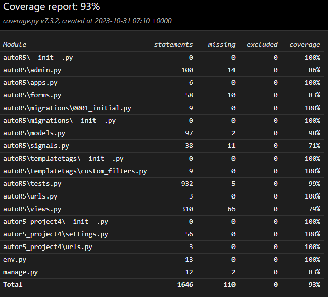

# Tests

## Responsiveness

The responsiveness of all pages was tested on various screen sizes starting from 320px and above, as per the guidelines of WCAG 2.1 Reflow for responsive design on Chrome, Edge, Firefox, and Opera browsers. [Websiteplanet](https://www.websiteplanet.com/webtools/responsive-checker/) was used for this purpose, which offered various emulated mobile devices such as Samsung and Apple smartphones with different screen sizes. In addition to this, Google Chrome developer tools was used.

To test:

1. Open a browser and go to the [AutoR5 website](https://autor5-33d529a804c5.herokuapp.com/).
2. Right-click and select "Inspect" to open the developer tools.
3. Change the view to "responsive" and decrease the width to 320px.
4. Set the zoom to 50%.
5. Increase the width of the responsive window to its maximum.
Expected Result:

The website should be responsive on all screen sizes, with no stretched or pixelated images.
There should be no horizontal scrolling.
No elements should overlap.
Actual Result:

The website performed as expected.

## Accessability

The website was tested using the [Wave Accessability Tool](https://wave.webaim.org/) to make sure it met certain accessibility standards. The focus was on ensuring that all forms were easily accessible, with clear labels or descriptions for screen readers. Color contrasts met the minimum requirements set by the WCAG 2.1 Contrast Guidelines, and the headings were in the correct order to properly convey the importance of the content. All the content was organized into sections, so it was easy to navigate with assistive technology. Any non-text content had descriptive text or titles, and the HTML page language was set correctly. The website was also checked to make sure that the Aria properties were used correctly and that it followed the best coding practices for WCAG 2.1.

## Lighthouse Test

## Weblink Test

## Automated Tests


## AutoR5 Testing Overview

The AutoR5 application has been subjected to comprehensive testing to verify its functionality, reliability, and user satisfaction. The testing process covers various aspects of the application, ensuring its robustness and dependability.

### Backend Testing:

1. **Database Models:** The application's database models have undergone rigorous testing to guarantee data consistency and accuracy. Extensive test cases have been designed to validate fields, relationships, and model methods, ensuring reliable data storage and retrieval.

2. **URLs and Views:** URL patterns and view behavior have been verified through test cases to ensure the application correctly maps views to URLs and returns expected responses. This enhances the overall user experience.

3. **Form Submission:** Handling form data is a critical component of the application. Test cases have been created to validate the processing of user input, covering both valid and invalid scenarios.

4. **File Uploads with Mocking:** To ensure the correct handling of file uploads, the application employs Django's `SimpleUploadedFile` and mocking libraries. This approach verifies that the application accurately processes uploaded files while isolating external dependencies.

### Frontend Testing Using Selenium:

Frontend testing focuses on evaluating the user interface and its interactive components. Selenium is utilized to automate browser interactions and evaluate the application's frontend functionality. You will need chromedriver and a test supporting browser to run the frontend tests, for more information and how to get setup see [ChromeDriver](https://chromedriver.chromium.org/home).

1. **Jarallax Initialization:** The application employs the Jarallax effect for added depth and interaction. Testing ensures that it initializes correctly and functions as expected.

2. **Message Alerts:** The application's handling of message alerts is tested to ensure users receive appropriate notifications and feedback during their interactions.

3. **AJAX-Based Filtering:** AutoR5 employs AJAX-based filtering, which is thoroughly tested by selecting filter options, applying filters, and resetting them. This ensures accurate UI updates based on user input.

4. **Map Display:** Tests verify that map elements and markers are correctly displayed to users, guaranteeing a seamless user experience.

### Mocking in Testing:

The testing approach emphasizes the use of mocking to simulate interactions with external services and data sources. This practice allows for tests that are isolated from external dependencies, ensuring that the application's functionality is assessed independently.

### Payment Integration Testing:

For e-commerce applications like AutoR5, payment gateways are crucial. Payment integration testing is conducted using mocking to prevent actual payment transactions. This ensures the correct handling of various payment scenarios while safeguarding the application's interaction with payment gateways.

In conclusion, the AutoR5 application has undergone meticulous and comprehensive testing. Through the use of tools such as `unittest`, Selenium, and mocking libraries, each component of the app has been thoroughly assessed. This rigorous testing approach has enabled the identification and resolution of issues early, resulting in a dependable, robust, and user-friendly car rental web application.

## `CarModelTest` - Testing Car Model

**1. `test_car_string_representation`**
- This test checks if the string representation of a car model is correctly formatted as "year make model."

**2. `test_make_content`**
- This test verifies that the "make" attribute of the car model matches the expected value.

**3. `test_model_content`**
- This test ensures that the "model" attribute of the car model matches the expected value.

**4. `test_year_content`**
- This test validates that the "year" attribute of the car model matches the expected value.

**5. `test_license_plate_content`**
- This test checks if the "license_plate" attribute of the car model matches the expected value.

**6. `test_daily_rate_content`**
- This test verifies that the "daily_rate" attribute of the car model matches the expected value.

**7. `test_is_available_content`**
- This test checks if the "is_available" attribute of the car model is initially set to `True`.

**8. `test_latitude_content`**
- This test ensures that the "latitude" attribute of the car model matches the expected value with a tolerance of 6 decimal places.

**9. `test_longitude_content`**
- This test verifies that the "longitude" attribute of the car model matches the expected value with a tolerance of 6 decimal places.

**10. `test_location_city_content`**
- This test checks if the "location_city" attribute of the car model matches the expected value.

**11. `test_location_address_content`**
- This test ensures that the "location_address" attribute of the car model matches the expected value.

**12. `test_features_content`**
- This test validates that the "features" attribute of the car model matches the expected value.

**13. `test_car_type_content`**
- This test checks if the "car_type" attribute of the car model matches the expected value.

**14. `test_fuel_type_content`**
- This test verifies that the "fuel_type" attribute of the car model matches the expected value.

## `BookingModelTest` - Testing Booking Model

**1. `test_create_booking`**
- This test creates a booking and verifies that it is created correctly with the expected user, car, rental dates, status, and total cost.

**2. `test_completed_booking`**
- This test checks if a booking's status is automatically updated to 'Completed' when the return date is in the past.

**3. `test_calculate_total_cost`**
- This test calculates the total cost for a booking and ensures that it matches the expected value.

## `PaymentModelTest` - Testing Payment Model

**1. `test_payment_creation`**
- This test creates a payment instance and verifies that it is created correctly with the expected user, booking, amount, payment method, and payment status.

## `CancellationModelTest` - Testing Cancellation Request Model

**1. `test_string_representation`**
- This test checks the string representation of a cancellation request to ensure it is correctly formatted as "Cancellation request for [booking]."

**2. `test_defaults`**
- This test verifies that the default value for the "approved" attribute of a cancellation request is `False`.

## `ReviewModelTest` - Testing Review Model

**1. `test_review_rating_validator`**
- This test validates the review rating by checking a valid rating (5 stars) and an invalid rating (0 stars) to ensure that the validation logic works correctly.

**2. `test_review_string_representation`**
- This test checks the string representation of a review to ensure it is correctly formatted as "Review for [car] by [user]."

## `UserProfileModelTest` - Testing User Profile Model

**1. `test_user_profile_creation`**
- This test verifies that a user profile is correctly created.

**2. `test_user_profile_str_method`**
- This test checks the `__str__` method of the user profile to ensure it returns the username.

**3. `test_user_profile_email_property`**
- This test checks the email property of the user profile to ensure it matches the expected email.

## `ContactFormSubmissionModelTest` - Testing Contact Form Submission Model

**1. `test_create_contact_submission`**
- This test creates a contact form submission and verifies that it is created correctly with the expected first name, last name, email, subject, and message.

**2. `test_submission_str_representation`**
- This test checks the string representation of a contact form submission to ensure it is correctly formatted as "[first name] [last name] - [subject]."

Certainly! Here's the documentation for your additional tests in Markdown format:

## `IndexViewTest` - Testing the Index View

**1. `test_index_view`**
- This test verifies the functionality of the index view.
- It creates sample car data, issues a GET request to the index view, and checks the response content.
- It checks if the response status code is 200 (OK), and whether it displays car types, fuel types, and the template used for rendering.

## `CarsListViewTest` - Testing the Cars List View

**1. `test_cars_list_view`**
- This test checks the functionality of the cars_list view without any filtering parameters.
- It issues a GET request to the cars_list view and ensures that all cars are displayed in the response.
- It checks that the response status code is 200 (OK).

**2. `test_cars_list_view_with_filter`**
- This test simulates filtering parameters in the URL to test the filtering functionality.
- It issues a GET request to the cars_list view with filtering parameters and checks if the response correctly displays filtered car data.
- It checks that the response status code is 200 (OK) and ensures that specific HTML elements are present in the response while others are not.

## `CarDetailTest` - Testing the Car Detail View

**1. `test_car_detail_view`**
- This test validates the functionality of the car_detail view.
- It logs in a user, accesses the car_detail view for a specific car, and checks if the car's details and a review are displayed in the response content.
- It checks that the response status code is 200 (OK).

## `BookCarViewTest` - Testing the Book Car View

**1. `test_book_car_view_with_valid_data`**
- This test verifies the book_car view's functionality with valid booking data.
- It logs in a user, accesses the book_car view with valid booking data, and checks if a booking is created with the expected status.
- It checks that the response status code is as expected.

**2. `test_book_car_view_with_invalid_data`**
- This test checks the behavior of the book_car view with invalid booking data.
- It logs in a user, accesses the book_car view with missing required fields, and checks if an error message is displayed in the response.
- It confirms that the user is redirected back to the booking page.

**3. `test_book_car_view_with_past_date`**
- This test examines the book_car view with a past rental date.
- It logs in a user, accesses the book_car view with a past rental date, and ensures an error message is displayed.
- The user is redirected back to the booking page.

**4. `test_book_car_view_with_conflicting_dates`**
- This test checks the book_car view with conflicting booking dates.
- It logs in a user, creates a valid booking, and then attempts to create another booking with the same dates.
- It ensures that an error message is displayed, and the user is redirected back to the booking page.

**5. `test_book_car_view_with_unavailable_car`**
- This test examines the behavior of the book_car view with an unavailable car.
- It logs in a user, sets the car as unavailable, and attempts to book the car.
- It checks if the user is redirected to the car detail page and receives an error message indicating that the car is not available for booking.

## `CheckoutViewTest` - Testing the Checkout View

**1. `test_checkout_view`**
- This test verifies the checkout view's functionality.
- It mocks the Stripe PaymentIntent creation, logs in a user, and issues a GET request to the checkout view.
- The test checks if the response status code is 200 (OK) and ensures that the necessary context data, such as the Stripe publishable key and client secret, booking ID, and total cost, are present.

**2. `test_checkout_view_stripe_error`**
- This test examines the behavior of the checkout view when a Stripe error is encountered during PaymentIntent creation.
- It mocks the Stripe PaymentIntent creation to raise an error, logs in a user, and issues a GET request to the checkout view.
- The test checks if the response is a redirect to the same checkout page, as expected due to the error.

## `BookingConfirmationViewTest` - Testing the Booking Confirmation View

**1. `test_successful_payment`**
- This test validates the functionality of the Booking Confirmation View in case of a successful payment.
- It sets up a scenario where the payment is successful, mocks Stripe's PaymentIntent retrieval, logs in a user, and issues a GET request to the booking confirmation view.
- The test checks if the payment and booking status are as expected.

**2. `test_pending_payment`**
- This test checks the behavior of the Booking Confirmation View when the payment is pending.
- It sets up a scenario with a pending payment, mocks Stripe's PaymentIntent retrieval, logs in a user, and issues a GET request to the booking confirmation view.
- The test ensures that the payment and booking status are as expected.

**3. `test_failed_payment`**
- This test examines the behavior of the Booking Confirmation View when the payment fails.
- It sets up a scenario with a failed payment, mocks Stripe's PaymentIntent retrieval, logs in a user, and issues a GET request to the booking confirmation view.
- The test checks if the payment and booking status are as expected.

## `CustomerDashboardViewTest` - Testing the Customer Dashboard View

**1. `test_view_url_exists_at_desired_location`**
- This test checks if the Customer Dashboard View exists at the desired URL.
- It ensures that the response status code is 200 (OK) when a logged-in user accesses the dashboard.

**2. `test_view_uses_correct_template`**
- This test validates that the Customer Dashboard View uses the correct template.
- It ensures that the response status code is 200 (OK) and verifies that the correct template, 'customer_dashboard.html,' is used.

**3. `test_view_with_no_login_redirects_to_login_page`**
- This test checks the behavior of the dashboard when a user is not logged in.
- It verifies that the response is a redirect to the login page with the 'next' parameter.

**4. `test_no_current_bookings_displayed`**
- This test confirms that the dashboard doesn't display any current bookings when there are none.
- It logs in a user and checks if the current_bookings context is an empty list.

**5. `test_current_bookings_displayed`**
- This test ensures that current bookings are displayed in the dashboard.
- It creates a booking, logs in a user, and verifies that the booking is present in the current bookings context.

**6. `test_no_past_bookings_displayed`**
- This test verifies that the dashboard doesn't display any past bookings when there are none.
- It logs in a user and checks if the past_bookings context is an empty list.

**7. `test_past_bookings_displayed`**
- This test ensures that past bookings are displayed in the dashboard.
- It creates a completed booking, logs in a user, and checks that the booking is present in the past bookings context.

**8. `test_no_reviews_displayed`**
- This test confirms that the dashboard doesn't display any reviews when there are none.
- It logs in a user and checks if the reviews context is an empty list.

**9. `test_reviews_displayed`**
- This test verifies that reviews are displayed in the dashboard.
- It creates and saves a review, logs in a user, and checks if the review's rating and comment are present in the response content.

**10. `test_cancellation_request_form_displayed`**
- This test ensures that the cancellation request form is displayed when the user has a booking to cancel.
- It creates a booking with a rental date in the future, logs in a user, and checks if the form is visible.

**11. `test_pending_payment_displayed`**
- This test checks if the "Pay Now" button is displayed for bookings with a 'Pending' status.
- It creates a booking with a 'Pending' status, logs in a user, and confirms that the button is present.

**12. `test_rebook_displayed`**
- This test verifies that the "Book Again" button is displayed for bookings with a 'Completed' status.
- It creates a booking with a 'Completed' status, logs in a user, and checks if the button is visible.

**13. `test_cancellation_request_with_approved_request`**
- This test examines the behavior of the dashboard after an approved cancellation request.
- It creates a booking, an approved cancellation request, and a completed payment, logs in a user, and verifies that the booking details and cancellation form are not displayed.

**14. `test_cancellation_request_without_approved_request`**
- This test checks the dashboard's behavior with an unapproved cancellation request.
- It creates a booking with an unapproved cancellation request, logs in a user, and ensures that the booking details are displayed, and the cancellation form is visible.

## `LeaveReviewViewTest` - Testing the Leave Review View

**1. `test_view_url_exists_at_desired_location`**
- This test checks if the Leave Review View exists at the desired URL.
- It ensures that the response status code is 200 (OK) when a logged-in user accesses the review view.

**2. `test_view_uses_correct_template`**
- This test validates that the Leave Review View uses the correct template.
- It ensures that the response status code is 200 (OK) and verifies that the correct template, 'leave_review.html,' is used.

**3. `test_review_form_submission`**
- This test verifies the functionality of submitting a review.
- It logs in a user and issues a POST request to the review view, checking for a redirect to the car detail page and a success message in the response content.

Sure, here's the documentation for your additional tests:

## `EditProfileViewTest` - Testing the Edit Profile View

**1. `test_edit_profile_valid_phone_number`**
- This test verifies the ability to update the user's phone number with a valid phone number.
- It posts a valid phone number to the edit profile view, checks if the response status code is 200, confirms that the user's profile has been updated with the new phone number, and ensures the success message is displayed in the response.

**2. `test_edit_profile_invalid_phone_number`**
- This test ensures that the edit profile view handles an invalid phone number correctly.
- It posts an invalid phone number to the view, checks if the response status code is 200, confirms that the user's profile phone number has not been updated to the invalid input, and checks that the response contains an error message stating that the phone number must be 9 to 10 digits long.

**3. `test_edit_profile_with_image_upload`**
- This test validates the functionality of uploading a profile picture while updating the user's profile.
- It creates a mock image file for testing, posts a phone number and the image file to the view, checks if the response status code is 200, confirms that the user's profile phone number is updated, and ensures that the image exists in Cloudinary.

## `ContactViewTest` - Testing the Contact Form Submission

**1. `test_contact_form_submission`**
- This test validates the behavior of submitting the contact form.
- It defines the data to be submitted, obtains the URL for the contact page, submits the form data to the page, checks that the response is a redirect (indicating a successful submission), ensures the form submission is saved to the database, and compares the submitted data with the saved data.

**2. `test_contact_form_invalid_submission`**
- This test ensures that the contact form correctly handles an invalid submission with missing data.
- It submits an empty form (invalid data) to the contact page, checks that the response is not a redirect (due to the form being invalid), and confirms that the response contains form errors for missing required fields, including 'first_name,' 'last_name,' 'email,' 'subject,' and 'message.'

## `CustomSignupFormTest` - Testing Custom Signup Form

**1. `test_valid_custom_signup_form`**
- This test ensures that the custom signup form correctly validates and accepts valid user registration data, including a phone number.
- It creates a dictionary with valid registration data, initializes the form with this data, and verifies that the form is valid.

**2. `test_invalid_custom_signup_form_missing_phone_number`**
- This test checks the behavior of the custom signup form when the phone number is missing in the registration data.
- It creates a dictionary with valid registration data but omits the phone number, initializes the form with this data, and checks that the form is not valid. It also ensures that an error is raised for the missing phone number.

## `BookingFormTest` - Testing Booking Form

**1. `test_valid_booking_form`**
- This test validates the booking form when provided with valid booking dates.
- It creates a dictionary with valid booking data (rental and return dates), initializes the form with this data, and verifies that the form is valid.

**2. `test_invalid_booking_form_return_date_before_rental_date`**
- This test ensures the booking form handles an invalid case where the return date is before the rental date.
- It creates a dictionary with an invalid booking data (return date before rental date), initializes the form with this data, and checks if the form has a validation error on the 'return_date' field.

## `ReviewFormTest` - Testing Review Form

**1. `test_valid_form`**
- This test verifies the behavior of a valid review form.
- It creates a dictionary with valid review data (rating and comment), initializes the form with this data, and ensures that the form is valid.

**2. `test_rating_out_of_range`**
- This test checks the review form's handling of an out-of-range rating value (greater than 5).
- It creates a dictionary with an invalid review data (rating greater than 5), initializes the form with this data, and verifies that the form is not valid. It also checks for the specific error message regarding the rating range.

**3. `test_rating_below_range`**
- This test evaluates how the review form handles a rating value below the specified range (less than 1).
- It creates a dictionary with an invalid review data (rating less than 1), initializes the form with this data, and checks if the form is not valid. The test also confirms the presence of an error message about the rating range.

**4. `test_missing_comment`**
- This test ensures that the review form correctly handles a case where the comment is missing.
- It creates a dictionary with valid review data but omits the comment, initializes the form with this data, and checks that the form is not valid.

## `ContactFormTest` - Testing Contact Form

**1. `test_valid_contact_form`**
- This test validates the contact form with valid contact data.
- It creates a dictionary with valid contact form data (first name, last name, email, subject, and message), initializes the form with this data, and verifies that the form is valid.

**2. `test_invalid_contact_form_missing_fields`**
- This test confirms that the contact form handles missing required fields correctly.
- It creates a dictionary with contact form data containing missing required fields (first name and email), initializes the form with this data, and checks that the form is not valid. The test also ensures that errors are raised for the missing fields.

## `CancellationRequestFormTest` - Testing Cancellation Request Form

**1. `test_valid_cancellation_request_form`**
- This test verifies the behavior of the cancellation request form when provided with valid cancellation reason data.
- It creates a dictionary with valid cancellation data, initializes the form with this data, and ensures that the form is valid.

**2. `test_invalid_cancellation_request_form_missing_reason`**
- This test checks how the cancellation request form handles cases where the cancellation reason is missing.
- It creates a dictionary with missing reason data, initializes the form with this data, and confirms that the form is not valid. It also checks for an error related to the missing reason field.

## `UserProfileFormTest` - Testing User Profile Form

**1. `test_valid_user_profile_form`**
- This test validates the user profile form with valid phone number data.
- It creates a dictionary with valid user profile data (phone number), initializes the form with this data, and verifies that the form is valid.

**2. `test_invalid_user_profile_form_invalid_phone_number`**
- This test ensures that the user profile form handles an invalid phone number correctly.
- It creates a dictionary with invalid user profile data (invalid phone number), initializes the form with this data, and checks that the form is not valid. It also ensures that an error is raised for the invalid phone number.

**3. `test_valid_user_profile_form_with_picture_upload`**
- This test validates the user profile form with a profile picture upload.
- It creates a mock image file for testing, simulates a form submission with valid user profile data and an uploaded image, initializes the form with this data, and verifies that the form is valid.

**4. `test_valid_user_profile_form_with_clear_picture`**
- This test checks the user profile form when "Clear Profile Picture" is checked.
- It creates valid user profile data with the "Clear Profile Picture" option checked, initializes the form with this data, and ensures that the form is valid.

Here are the descriptions for the additional tests:

## `CsvImportExportFormTest` - Testing CSV Import and Export Forms

**1. `test_import_csv_function`**
- This test checks the import functionality for CSV data. It creates a mock CSV file with car data, simulates an HTTP POST request to import the data, and verifies that the response status code is 302 (a successful redirect).
- After the import, it creates a Car object and checks that the data from the CSV file was correctly imported into the Car model.

**2. `test_export_csv_function`**
- This test ensures that the export functionality for CSV data works as expected. It first creates a Car object, simulates an HTTP GET request to export the data to a CSV file, and verifies that the response has a status code of 200 (indicating success).
- It then compares the exported CSV data with the expected data to ensure they match.

## `UpdateLocationTest` - Testing Location Update

**1. `test_update_location`**
- This test checks the functionality to update the location of a car. It begins by mocking the Nominatim geocoder and simulating the admin action to update the location.
- The test verifies that the location fields for the car are initially empty, and after the action is executed, the fields are updated with the expected location data.

## `TestUrls` - Testing URL Routing

- This set of tests ensures that the URL routing in the application correctly maps to the associated view functions.
- Each test, such as `test_index_url`, `test_car_detail_url`, and others, uses the `reverse` function to generate URLs and the `resolve` function to check which view function is associated with the URL. It then verifies that the resolved function matches the expected view function from the `views` module. This ensures that the application's URLs are correctly configured.

In these tests, you are using Selenium to perform end-to-end testing of the user interface and interactions. Here's a description of each of the Selenium tests:

## `JarallaxTest` - Testing Jarallax Initialization

**1. `test_jarallax_initialization`**
- This test checks the initialization of the Jarallax effect on a web page. It loads the page, waits for 2 seconds to ensure the JavaScript has time to run, and then finds an element with the Jarallax effect (CSS property 'transform').
- It verifies that the Jarallax effect is applied, for example, by checking for a specific CSS property on the element.

## `MessageAlertsTest` - Testing Message Alerts

**1. `test_message_alerts`**
- This test simulates a user interaction on a page where JavaScript is executed. It loads the page, clicks a "Log In" button, finds the login form elements (username, password, and login button), and enters login credentials.
- It waits for a message container to be displayed, checks that the message container is displayed with a specific CSS property ('display' property), and ensures that the message contains the expected text, such as "Successfully signed in."
- Finally, it verifies that the message container is no longer displayed.

## `AJAXFilterTests` - Testing AJAX-Based Filtering

**1. `test_dropdown_updates`**
- This test simulates the interaction with dropdown filters on a web page. It selects values in various dropdowns (car make, model, year, etc.), clicks a filter button, and waits for the filter to update the page.
- It then checks that after applying the filter, there is only one element with a class "item-wrapper." It also clicks the reset button to ensure that more than one "item-wrapper" is present after resetting the filter.

## `MapTest` - Testing Map Display

**1. `test_map_displayed`**
- This test checks the display of a map on a page. It loads a page where a map is initialized using JavaScript, enters login credentials, and waits for a few seconds.
- It verifies that the map element is present and displayed on the page. Additionally, it checks that the map has a marker displayed (using the presence of a marker element with a class name).

These tests help ensure that the web application's JavaScript features, message alerts, AJAX-based filtering, and map displays are functioning correctly from the user's perspective.

# Results:

Overall the automated test have all pass without failure with a coverage report also of 95%



```bash
----------------------------------------------------------------------
Ran 102 tests in 89.524s

OK