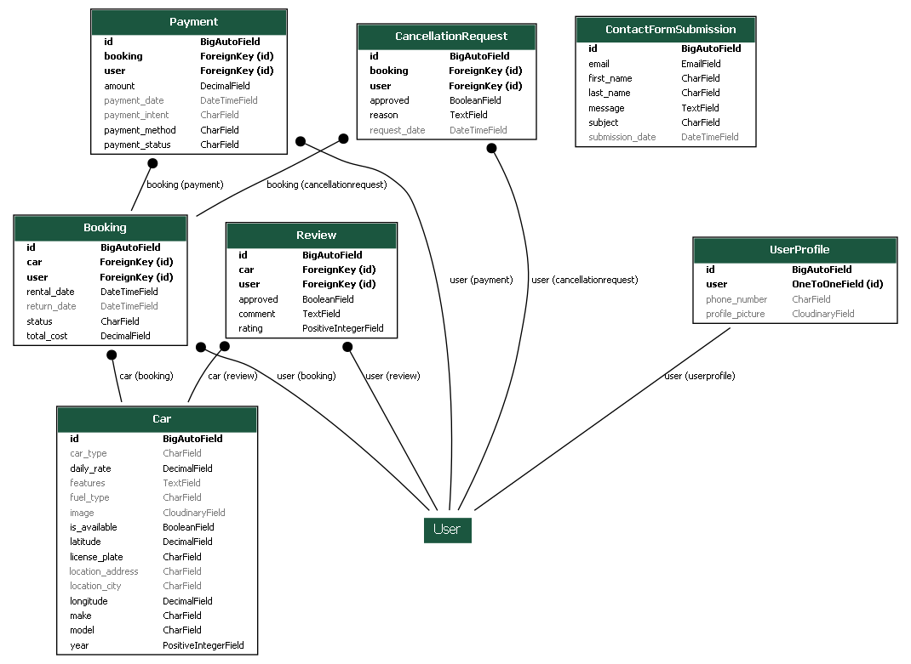
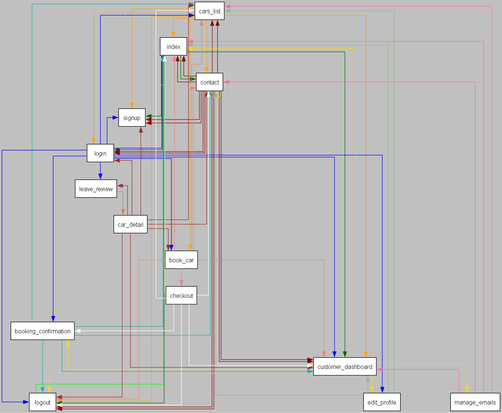

# The Code (Powered by Django)

The **autoR5** car rental system is built on the Django framework, offering a comprehensive solution for car management, bookings, and user interactions. The code comprises several components:

- **Models**: Define the database structure for cars, bookings, payments, and more.
- **Admin**: Configuration for the Django admin panel.
- **App**: Core app configuration.
- **Forms**: Defines form structure.
- **Signals**: Event handlers for real-time actions.
- **URLs**: URL patterns for mapping to views.
- **Views**: Handle HTTP requests and user interactions.
- **Settings**: Configure Django settings, database connections, and more.
- **HTML Templates**: Structure the frontend UI.
- **JavaScript**: Enhance interactivity and manage payments.
- **CSS**: Style the user interface.

This Django-powered codebase drives the **autoR5** car rental system, ensuring a seamless experience for users.

## Models

The `models.py` file in the **autoR5** car rental system contains Django models for various aspects of the application. These models define the database structure and relationships between different entities.

### Car Model

The `Car` model represents car details and properties available for rental. Each car is defined by the following fields:
- `make`: The car's make, such as the manufacturer.
- `model`: The car's model.
- `year`: The car's manufacturing year.
- `license_plate`: The unique license plate of the car.
- `daily_rate`: The daily rental rate for the car.
- `is_available`: A boolean indicating whether the car is available for rent.
- `latitude` and `longitude`: The geographic coordinates of the car's location.
- `location_city` and `location_address`: The city and address of the car's location.
- `image`: Image of the car.
- `features`: Additional features or information about the car.

The model also includes choices for car types and fuel types. It has methods for getting the absolute URL and displaying car information.

### Booking Model

The `Booking` model manages car bookings. It has the following fields:
- `user`: A foreign key to the user who made the booking.
- `car`: A foreign key to the booked car.
- `rental_date`: The start date and time of the rental.
- `return_date`: The return date and time of the rental.
- `total_cost`: The total cost of the booking.
- `status`: The status of the booking (e.g., Pending, Confirmed, Completed, Canceled).

The model includes methods for calculating the total cost, handling status changes, and saving the booking.

### Payment Model

The `Payment` model records user payments. It includes fields for:
- `user`: A foreign key to the user making the payment.
- `booking`: A foreign key to the booking associated with the payment.
- `amount`: The payment amount.
- `payment_date`: The date and time of the payment.
- `payment_method`: The payment method used.
- `payment_status`: The status of the payment (e.g., Pending, Paid, Failed, Refunded, Canceled).
- `payment_intent`: An optional payment intent.

### CancellationRequest Model

The `CancellationRequest` model records booking cancellation requests. It includes fields for:
- `booking`: A foreign key to the booking for which the cancellation is requested.
- `user`: A foreign key to the user making the request.
- `request_date`: The date and time of the request.
- `reason`: The reason for the cancellation request.
- `approved`: A boolean indicating whether the request is approved.

### Review Model

The `Review` model allows users to leave reviews for cars. It includes fields for:
- `car`: A foreign key to the reviewed car.
- `user`: A foreign key to the user leaving the review.
- `rating`: The rating given to the car (1-5).
- `comment`: The review comment.
- `approved`: A boolean indicating whether the review is approved.

### UserProfile Model

The `UserProfile` model extends the built-in `User` model with additional information, including:
- `phone_number`: The user's phone number.
- `profile_picture`: An optional profile picture.

### ContactFormSubmission Model

The `ContactFormSubmission` model records contact form submissions. It includes fields for:
- `first_name` and `last_name`: The submitter's name.
- `email`: The submitter's email address.
- `subject`: The subject of the submission.
- `message`: The submission message.
- `submission_date`: The date and time of the submission.

## Admin

### CarAdmin
- Manages car listings and related actions in the admin panel.
- Provides the ability to update car locations.
- Offers importing and exporting car data as CSV.

### BookingAdmin
- Manages car bookings and their details.
- Lists user, car, rental date, return date, total cost, and booking status.
- Allows searching for bookings based on user, car make, model, and year.

### ReviewAdmin
- Handles car reviews and their details.
- Displays car, user, rating, and comments.
- Allows searching for reviews based on car make, model, and user.

### UserProfileAdmin
- Manages user profiles, including phone numbers and email addresses.
- Lists user, phone number, and email.
- Allows searching for profiles based on the username and phone number.

### PaymentAdmin
- Manages payment records and their details.
- Displays user, booking, amount, payment date, method, and status.
- Allows searching for payments based on username and booking ID.

### CancellationRequestAdmin
- Manages booking cancellation requests.
- Lists booking, user, request date, and reason for cancellation.
- Allows searching for requests based on username, booking ID, and reason.

### ContactFormSubmissionAdmin
- Manages contact form submissions.
- Displays first name, last name, email, and subject of inquiries.

## App Configuration: `autoR5`

- `Autor5Config` is the app configuration class for **autoR5** within your Django project.
- It defines app-specific configurations, including the name of the app and the default auto field.

### Attributes

- `name`: The name of the app, which is set to `'autoR5'`.

### Methods

- `ready()`: This method is called when the app is ready to perform any necessary setup or registration. In this case, it imports signals from the 'signals' module within the 'autoR5' app. Signals are used to define custom actions and behavior that occur during various events in the app.

## Forms

### CustomSignupForm
- Extends: `SignupForm`
- Customizes the sign-up form for user registration.
- Adds a `phone_number` field, which is a required field for users to provide their phone number during sign-up.
- Overrides the `save` method to save the phone number to the user's profile.

### BookingForm
- Used for booking a car.
- Model form for the `Booking` model.
- Includes fields for `rental_date` and `return_date`.
- Utilizes widgets to render date pickers for date input.
- Performs validation to ensure that the return date is after the rental date.

### ReviewForm
- Used for submitting a car review.
- Model form for the `Review` model.
- Includes fields for `rating` and `comment`.

### ContactForm
- Used for contacting support.
- Includes fields for `first_name`, `last_name`, `email`, `subject`, and `message`.
- The `message` field is a text area for users to provide detailed messages.

### CancellationRequestForm
- Used for canceling a booking.
- Model form for the `CancellationRequest` model.
- Includes a `reason` field with a text area for users to specify their reasons for cancellation.

### UserProfileForm
- Used for updating user profile information.
- Model form for the `UserProfile` model.
- Includes fields for `phone_number`, `profile_picture_upload`, and `clear_picture`.
- Provides validators for the phone number field and allows users to upload and clear their profile picture.
- Uses the `crispy_forms` package for rendering forms with custom layouts.

### CsvImportForm
- Used for importing data from a CSV file.
- Includes a `csv_import` field for users to select a CSV file for data import.

## Signals

### Custom Signals and Receivers

#### `RefundProcessingError`
- Custom exception raised for refund processing errors.

#### `create_user_profile` Signal Receiver
- Connected to the `post_save` signal of the `User` model.
- Automatically creates a user profile when a new user is registered.

#### `process_cancellation_request` Signal Receiver
- Connected to the `post_save` signal of the `CancellationRequest` model.
- Handles the processing of cancellation requests.
- If a cancellation request is approved:
  - Checks the payment status of the associated booking.
  - If the payment is not paid, cancels the booking and updates the payment status.
  - If the payment is paid, initiates a refund using the Stripe API.
  - Handles refund status, updating payment and booking accordingly.
  - Marks the car as available again after a successful refund.
  - Raises a `RefundProcessingError` in case of processing errors.

## URL Patterns

### Index
- URL: `/`
- View: `views.index`
- Description: The home page of the application.

### Car Detail
- URL: `/car/<int:car_id>/`
- View: `views.car_detail`
- Description: Display details of a specific car.

### Book Car
- URL: `/car/<int:car_id>/book/`
- View: `views.book_car`
- Description: Allows users to book a specific car.

### Booking Confirmation
- URL: `/booking/<int:booking_id>/confirmation/`
- View: `views.booking_confirmation`
- Description: Displays booking confirmation details.

### Leave Review
- URL: `/car/<int:car_id>/review/`
- View: `views.leave_review`
- Description: Allows users to leave a review for a specific car.

### Cars List
- URL: `/cars_list/`
- View: `views.cars_list`
- Description: Displays a list of cars and provides filtering options.

### Contact
- URL: `/contact/`
- View: `views.contact`
- Description: Allows users to contact support.

### Customer Dashboard
- URL: `/dashboard/`
- View: `views.dashboard`
- Description: Displays a dashboard for logged-in customers with booking information and cancellation requests.

### Edit Profile
- URL: `/edit_profile/`
- View: `views.edit_profile`
- Description: Allows users to edit their profile information.

### Get Car Makes
- URL: `/get_car_makes/`
- View: `views.get_car_makes`
- Description: Retrieves car makes through AJAX requests.

### Get Car Models
- URL: `/get_car_models/`
- View: `views.get_car_models`
- Description: Retrieves car models through AJAX requests.

### Get Car Years
- URL: `/get_car_years/`
- View: `views.get_car_years`
- Description: Retrieves car years through AJAX requests.

### Get Car Locations
- URL: `/get_car_locations/`
- View: `views.get_car_locations`
- Description: Retrieves car locations through AJAX requests.

### Get Car Types
- URL: `/get_car_types/`
- View: `views.get_car_types`
- Description: Retrieves car types through AJAX requests.

### Get Fuel Types
- URL: `/get_fuel_types/`
- View: `views.get_fuel_types`
- Description: Retrieves fuel types through AJAX requests.

### Checkout
- URL: `/car/<int:car_id>/book/<int:booking_id>/checkout/`
- View: `views.checkout`
- Description: Handles the checkout process for booking a car.

## Project Settings Documentation

This document provides an overview of the settings used in the Django project 'autor5_project4'.

### Key Project Information

- Project Name: autor5_project4
- Django Version: 4.2.5

### Project Structure

- The project uses [Django](https://docs.djangoproject.com/en/4.2/) as its web framework.
- The project's directory structure is organized using Python's pathlib and includes templates, static files, and media files.

### Security and Authentication

- **SECRET_KEY:** The secret key used to secure the project. It is stored in an environment variable.
- **DEBUG:** Debug mode is enabled for development and disabled for production.
- **ALLOWED_HOSTS:** List of allowed hostnames for the project.

### Installed Apps

- The project includes various Django apps and third-party packages for functionality.
- Notable apps include 'allauth' for authentication and 'cloudinary' for media storage.

### Authentication and User Management

- The project utilizes 'allauth' for user authentication and management.
- Custom forms, including 'CustomSignupForm,' are used for user registration.
- Various authentication backends are specified for authentication.
- Messages are customized and displayed using Bootstrap alert styles.

### Middleware

- Security middleware and 'whitenoise' for serving static files are included.
- 'allauth' middleware is used for account management.

### Template Configuration

- The 'TEMPLATES' setting configures Django templates, including template packs for Crispy Forms and Bootstrap.

### Database Configuration

- The project uses a PostgreSQL database, with configurations defined using 'dj_database_url.'
- A test database (SQLite) is also configured.

### Password Validation

- Password validators are defined for strong password policies.

### Internationalization and Time Zone

- Internationalization and time zone settings are configured.

### Static and Media Files

- Static and media file storage, including Cloudinary for media, is set up.
- Static files are collected to a 'staticfiles' directory.
- Media files are managed using 'MediaCloudinaryStorage.'
- Static files are served through 'StaticHashedCloudinaryStorage.'

### Email Configuration

- SMTP settings are configured for sending emails.
- Email backend, host, user, and password are specified.

### Additional Features

- Stripe integration for payments, with secret and publishable keys defined.

## Views

### Home Page (index)
- Displays the home page with unique car types and fuel types.

### List of Cars (cars_list)
- Displays a list of available cars with filtering options.
- Supports filtering by make, model, year, location, car type, and fuel type.
- Implements pagination for car listings.

### Get Car Makes (get_car_makes)
- Retrieves car makes through AJAX to populate filtering options.

### Get Car Models (get_car_models)
- Retrieves car models through AJAX based on the selected make.

### Get Car Years (get_car_years)
- Retrieves car years through AJAX based on the selected model.

### Get Car Types (get_car_types)
- Retrieves car types through AJAX based on the selected year.

### Get Fuel Types (get_fuel_types)
- Retrieves fuel types through AJAX based on the selected car type.

### Get Car Locations (get_car_locations)
- Retrieves car locations through AJAX for filtering.

### Car Detail (car_detail)
- Displays details of a specific car, including reviews.

### Book a Car (book_car)
- Allows users to book a car, checking availability and handling date conflicts.
- Calculates the total cost of the booking and manages payments.

### Checkout (checkout)
- Handles the checkout process for booking payments.
- Uses Stripe API for payment processing.

### Booking Confirmation (booking_confirmation)
- Displays the booking confirmation status.
- Handles payment success, processing, and failure.

### Leave a Review (leave_review)
- Enables users to leave reviews for cars.

### Customer Dashboard (dashboard)
- Provides a dashboard for registered users.
- Lists current and past bookings, reviews, and allows cancellation requests.

### Edit Profile (edit_profile)
- Allows users to edit their profile information, including phone number and profile picture.

### Contact (contact)
- Provides a contact form for user inquiries and feedback.
- Saves form submissions to the database and notifies the user.

### Delete Booking (delete_booking)
- Allows authenticated users to delete a booking.
- Verifies user ownership of the booking and displays success or error messages.
- Redirects to the customer dashboard after performing the delete operation.

### Approve/Reject Cancellation Request (approve_reject_cancellation_request)
- Intended for staff members (users with 'is_staff' privilege) to approve or reject a cancellation request.
- 'approve' action sets the 'approved' field to True.
- 'reject' action deletes the cancellation request.
- Handles cancellation request not found and displays appropriate messages.
- Redirects to the 'dashboard' view after performing the approval or rejection action.

## base.html Template Documentation

The `base.html` template serves as the foundational structure for this website's pages. It includes the header, navigation menu, footer, and links to various styles and scripts.

### Meta Tags and Favicon

- The template defines meta tags for character set, compatibility, and viewport settings.
- It links to the website's favicon using the `` template tag.

### Title

- The `<title>` element sets the title of the web page.

### Styles and Scripts

- The template includes CSS stylesheets for Bootstrap, custom styles, fonts, and Jarallax plugin.
- It also imports jQuery and links JavaScript scripts for various functionalities.

### Navigation Menu

- The navigation menu contains links to essential pages: Home, Our Fleet, and Contact Us.
- It also provides login, signup, logout, and dashboard links based on user authentication status.

### Message Alerts

- A message container is provided for displaying alerts, such as success or error messages.
- Messages are generated dynamically and can be dismissed by the user.

### Page Content

- The `` tag is included for extending this template in specific pages.
- The content of individual pages is placed within this block.

### Footer

- The footer contains links to the Home, Our Fleet, and Contact Us pages.
- It includes social media icons with links to Instagram, Facebook, and GitHub.
- A copyright notice is displayed at the bottom.

### JavaScript and Other Libraries

- The template imports JavaScript libraries for Bootstrap, Jarallax, Font Awesome, Leaflet, and Stripe.
- It includes a custom JavaScript file, `script.js`, for site-specific functionality.

## JavaScript

### Jarallax Parallax Scrolling

The Jarallax plugin is used for implementing parallax scrolling effects on elements with the `jarallax` class. This provides a visually appealing scrolling experience.

### Message Alerts

Message alerts are displayed to provide feedback or information to the user. Messages are displayed in a message container with animation, and they can automatically disappear after a few seconds. Users can also manually close the messages.

### Filtering Options

Filtering options are implemented using jQuery. These options allow users to filter car models, years, types, and fuel types. The code makes AJAX requests to retrieve data for populating dropdowns based on user selections.

### Display Car Location on a Map

Car locations are displayed on a map using the Leaflet library. The latitude and longitude of the car are retrieved from the HTML element, and a marker is added to the map.

### Payment Handling

The JavaScript code provides functionality for handling payments using the Stripe payment gateway. It initializes Stripe elements for payment, collects payment information, and handles payment confirmation.